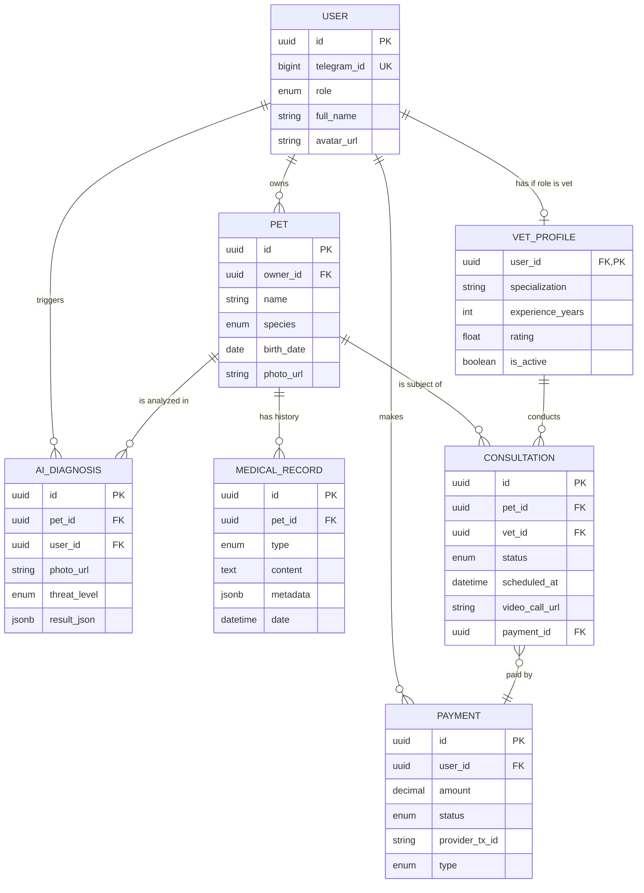

# Data Model: Телемед-Питомец

## 1. Доменная модель (Domain Model)

### 1.1 Глоссарий (Ubiquitous Language)
| Термин | Определение | Контекст |
|--------|-------------|----------|
| Владелец | Пользователь Telegram, имеющий домашних животных. | Основной клиент |
| Ветеринар | Партнер платформы, оказывающий консультации. | Исполнитель |
| Питомец | Животное любого вида, зарегистрированное в системе. | Объект заботы |
| ИИ-диагностика | Процесс анализа изображения симптома нейросетью. | Предварительная проверка |
| Консультация | Дистанционный прием врача через видеосвязь. | Услуга |

### 1.2 Агрегаты (Aggregates)

#### Агрегат: User (Пользователь)
**Root Entity:** `User`
**Invariants:**
- У каждого пользователя должен быть уникальный `telegram_id`.
- Только пользователи с ролью `VET` могут иметь `VetProfile`.

#### Агрегат: Pet (Питомец)
**Root Entity:** `Pet`
**Invariants:**
- Питомец всегда принадлежит одному владельцу.
- Медицинские записи не могут существовать без привязки к питомцу.

#### Агрегат: Consultation (Консультация)
**Root Entity:** `Consultation`
**Invariants:**
- Консультация требует подтвержденного платежа (кроме бесплатных/акционных).
- Статус `COMPLETED` возможен только после проведения звонка или истечения времени.

---

## 2. Сущности и атрибуты

### 2.1 Пользователи (Users)
... (остальное содержание остается таким же) ...
Базовая сущность для всех участников платформы. Разделение на роли (Владелец/Врач) реализовано через поле `role` и расширение профиля для ветеринаров.

| Атрибут | Тип | Описание |
|---------|-----|----------|
| id | UUID | Первичный ключ |
| telegram_id | BigInt | Уникальный ID пользователя в Telegram |
| role | Enum | Роль: `OWNER`, `VET`, `ADMIN` |
| full_name | String | ФИО пользователя |
| email | String | Email (опционально) |
| phone | String | Телефон (опционально) |
| avatar_url | String | Ссылка на фото профиля |
| created_at | DateTime | Дата регистрации |

#### VetProfile (Профиль врача)
Дополнительные данные для пользователей с ролью `VET`.

| Атрибут | Тип | Описание |
|---------|-----|----------|
| user_id | UUID (FK) | Ссылка на пользователя |
| specialization | String | Специализация (терапевт, хирург и т.д.) |
| experience_years | Int | Стаж работы |
| bio | Text | О себе, образование |
| rating | Float | Средний рейтинг по отзывам |
| is_active | Boolean | Статус доступности для консультаций |

### 1.2 Питомцы (Pets)
Сущность домашнего животного, принадлежащего владельцу.

| Атрибут | Тип | Описание |
|---------|-----|----------|
| id | UUID | Первичный ключ |
| owner_id | UUID (FK) | Ссылка на владельца (`User.id`) |
| name | String | Кличка питомца |
| species | Enum | Вид: `CAT`, `DOG`, `BIRD`, `REPTILE`, `OTHER` |
| breed | String | Порода (опционально) |
| birth_date | Date | Дата рождения |
| gender | Enum | Пол: `MALE`, `FEMALE`, `UNKNOWN` |
| photo_url | String | Ссылка на фото питомца |

### 1.3 Медицинские записи (Medical Records / Health Diary)
События в дневнике здоровья питомца.

| Атрибут | Тип | Описание |
|---------|-----|----------|
| id | UUID | Первичный ключ |
| pet_id | UUID (FK) | Ссылка на питомца |
| type | Enum | Тип записи: `SYMPTOM`, `WEIGHT`, `VACCINATION`, `MEDICATION`, `NOTE` |
| content | Text | Текстовое описание |
| metadata | JSONB | Доп. данные (вес в кг, дозировка лекарства и т.д.) |
| date | DateTime | Дата события |
| created_at | DateTime | Дата создания записи |

### 1.4 Консультации (Consultations)
Сеансы телемедицинской связи между владельцем и врачом.

| Атрибут | Тип | Описание |
|---------|-----|----------|
| id | UUID | Первичный ключ |
| pet_id | UUID (FK) | Ссылка на питомца |
| vet_id | UUID (FK) | Ссылка на врача (`User.id`) |
| status | Enum | Статус: `SCHEDULED`, `IN_PROGRESS`, `COMPLETED`, `CANCELLED` |
| scheduled_at | DateTime | Запланированное время начала |
| duration | Int | Длительность в минутах |
| video_call_url| String | Ссылка на комнату видеозвонка (WebRTC) |
| summary | Text | Заключение врача после звонка |
| payment_id | UUID (FK) | Ссылка на платеж |

### 1.5 ИИ-диагностики (AI Diagnostics)
Результаты автоматизированного анализа симптомов по фото.

| Атрибут | Тип | Описание |
|---------|-----|----------|
| id | UUID | Первичный ключ |
| pet_id | UUID (FK) | Ссылка на питомца |
| user_id | UUID (FK) | Ссылка на пользователя, запустившего анализ |
| photo_url | String | Ссылка на фото симптома |
| threat_level | Enum | Уровень угрозы: `LOW`, `MEDIUM`, `HIGH` |
| result_json | JSONB | Полный ответ от ML-модели |
| recommendation | Text | Сгенерированная рекомендация для пользователя |
| created_at | DateTime | Дата проведения анализа |

### 1.6 Платежи (Payments)
Транзакции за консультации и подписки.

| Атрибут | Тип | Описание |
|---------|-----|----------|
| id | UUID | Первичный ключ |
| user_id | UUID (FK) | Ссылка на плательщика |
| amount | Decimal | Сумма платежа |
| currency | String | Валюта (по умолчанию `RUB`) |
| status | Enum | Статус: `PENDING`, `SUCCESS`, `FAILED` |
| provider_tx_id| String | ID транзакции в Telegram Payments / Провайдере |
| type | Enum | Тип: `CONSULTATION`, `SUBSCRIPTION` |
| created_at | DateTime | Дата инициации платежа |

---

## 2. ER-диаграмма



---

## 3. Спецификация хранения медиа-файлов

Для обеспечения масштабируемости и производительности используется объектное хранилище (S3-совместимое).

### 3.1 Архитектура хранения
- **Хранилище:** Selectel Object Storage / Yandex Cloud Object Storage (локализация данных в РФ).
- **Доступ:** Приватные бакеты. Доступ пользователям предоставляется через **Presigned URLs** с ограниченным временем жизни (например, 15 минут).

### 3.2 Структура путей (Key Layout)
```text
/media
  /users
    /{user_id}
      /avatars/             # Фото профиля (WebP)
  /pets
    /{pet_id}
      /photos/              # Основное фото питомца (WebP)
      /records/             # Фото к записям в дневнике
  /ai-diagnostics
    /{diagnosis_id}
      /symptoms/            # Фото симптомов для анализа (WebP, исходники)
  /consultations
    /{consultation_id}
      /recordings/          # Видеозаписи консультаций (MP4/H.264)
      /attachments/         # Файлы, переданные в чате звонка
```

### 3.3 Технические требования
- **Форматы изображений:** 
  - На входе: JPEG, PNG, HEIC.
  - Хранение: Конвертация в **WebP** для оптимизации трафика в Telegram WebApp.
- **Видео:** 
  - Формат: MP4 (H.264 / AAC).
  - Нарезка на чанки для стриминга (HLS), если требуется просмотр длинных записей.
- **CDN:** Использование CDN для быстрой отдачи контента (например, Selectel CDN).
- **Безопасность:** 
  - Шифрование на стороне сервера (SSE).
  - Проверка MIME-типов при загрузке.
  - Ограничение размера файлов (Изображения до 10MB, Видео до 500MB).

---
*Документ создан: Data Agent | Дата: 2026-01-28*
