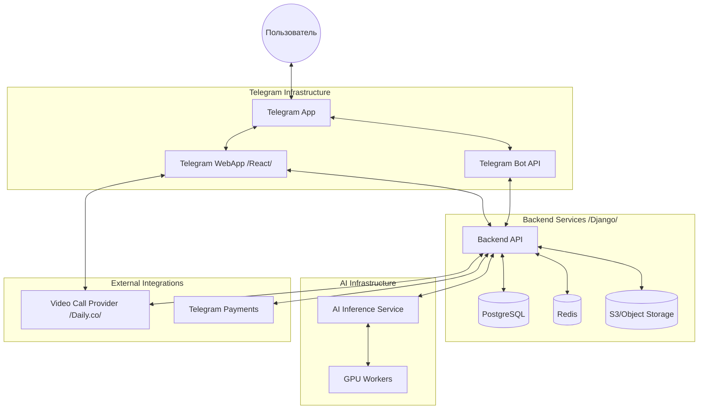

# System Design: Телемед-Питомец

## 1. High-Level Architecture

Система построена на базе клиент-серверной архитектуры с использованием Telegram WebApp в качестве фронтенда и микросервисного подхода для специализированных функций (ИИ, видеосвязь).

## 2. Основные компоненты

### 2.1 Frontend (React)
- **Telegram WebApp SDK**: Интеграция с интерфейсом Telegram (цветовые схемы, кнопки, haptic feedback).
- **WebRTC Client**: Интеграция с провайдером видеозвонков.
- **State Management**: Zustand или React Query для управления состоянием и кэшированием данных.

### 2.2 Backend (Django / DRF)
- **API Gateway/Core**: Обработка бизнес-логики, управление пользователями, питомцами и записями.
- **Telegram Bot Integration**: Обработка команд бота, отправка уведомлений и напоминаний через Celery/Redis.
- **Payment Integration**: Обработка транзакций через Telegram Payments.

### 2.3 AI Service
- **Computer Vision**: Обработка фотографий симптомов.
- **Triage Logic**: Классификация серьезности (Low/Med/High).
- **Async Processing**: Прием изображения -> постановка в очередь -> возврат результата через WebSocket или Long Polling.

### 2.4 Data Layer
- **PostgreSQL**: Основное хранилище (пользователи, медицинские карты питомцев, расписание врачей).
- **Redis**: Кэширование сессий, очередь задач (Celery), лимиты запросов.
- **S3 Storage**: Хранение фотографий питомцев и записей консультаций.

## 3. Взаимодействие компонентов

### 3.1 Сценарий ИИ-диагностики
1. Пользователь загружает фото в TWA.
2. TWA отправляет фото на Backend API.
3. Backend сохраняет фото в S3 и создает задачу в очереди.
4. AI Service забирает задачу, анализирует фото и возвращает результат Backend-у.
5. Backend уведомляет пользователя через TWA или сообщением от бота.

### 3.2 Сценарий Видеоконсультации
1. Пользователь записывается на время через TWA.
2. В назначенное время Backend создает "комнату" у видео-провайдера.
3. TWA получает URL комнаты и инициализирует WebRTC соединение.
4. После звонка Backend получает метаданные (длительность) и сохраняет отчет в медкарту.

---
*Документ создан: Architect Agent | Дата: 2026-01-28*
