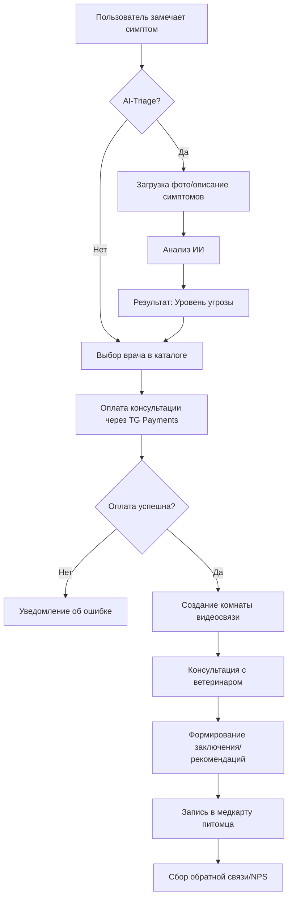
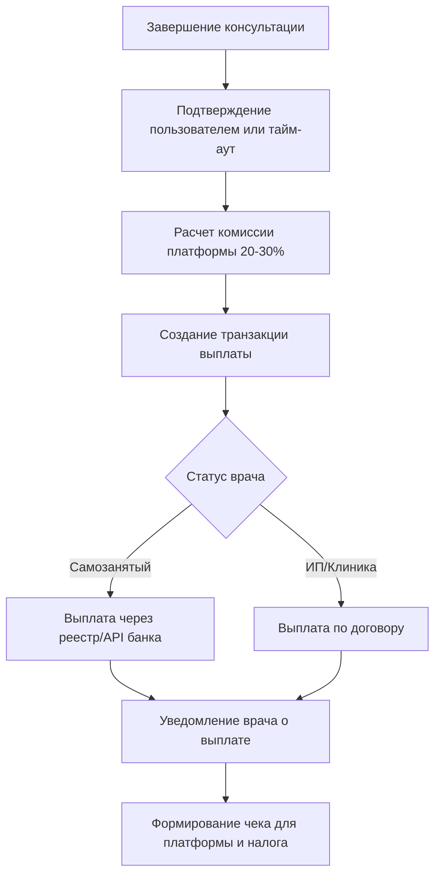
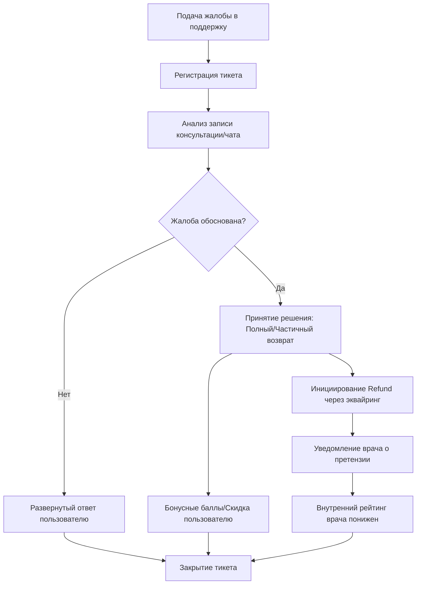

# Ключевые бизнес-процессы

В данном документе описаны основные операционные процессы платформы в формате BPMN (Mermaid).

## 1. Обработка заявки на консультацию (Request Handling)

Процесс от момента обнаружения симптома до получения протокола консультации.

---

## 2. Процесс выплаты ветеринару (Payout Process)

Автоматизированный процесс распределения средств между платформой и врачом.

---

## 3. Обработка жалобы пользователя (Complaint Handling)

Процесс разрешения конфликтных ситуаций и возврата средств.

---

## 4. Метрики эффективности процессов (KPI)

| Процесс | Метрика (KPI) | Целевое значение |
|---------|---------------|------------------|
| Обработка заявки | Time-to-Consult (от входа до начала) | < 10 минут |
| Выплата ветеринару | Задержка выплаты | T+1 день (авто) |
| Обработка жалобы | Время первого ответа поддержки | < 1 часа |
| Обработка жалобы | Доля возвратов (Refund Rate) | < 3% |

---
*Документ создан: Business-Analyst Agent | Дата: 2026-01-28*
