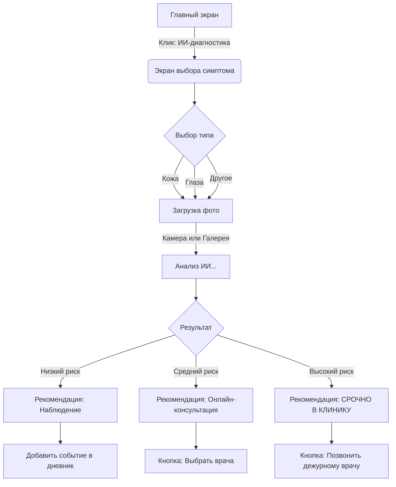
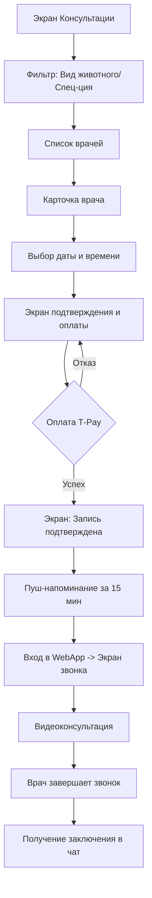
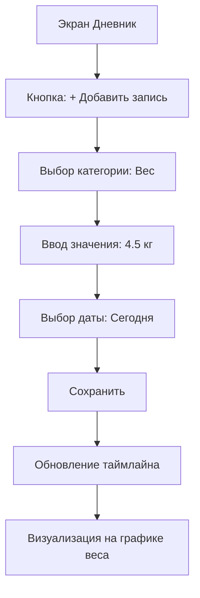

# Пользовательские сценарии (User Flows)

В этом документе описаны ключевые пути пользователя в приложении.

## 1. Прохождение ИИ-диагностики

Сценарий: Пользователь заметил покраснение на коже у собаки и хочет понять, насколько это опасно.

## 2. Запись и проведение видеоконсультации

Сценарий: Пользователю нужна помощь врача, он записывается на удобное время.

## 3. Добавление записи в дневник здоровья

Сценарий: Пользователь взвесил кота и хочет сохранить данные для истории.

## 4. Специфика Telegram WebApp

### Обработка состояний (Edge Cases)

| Сценарий | Поведение системы |
| :--- | :--- |
| **Потеря интернета** | Показывается системное уведомление. ИИ-анализ приостанавливается, при восстановлении — Resume. |
| **Звонок во время консультации** | WebApp сворачивается, но видеосвязь должна поддерживать фоновый режим (если позволяет браузер) или переподключаться при возврате. |
| **Недостаточно прав (Камера)** | Если пользователь запретил камеру, WebApp показывает инструкцию, как включить её в настройках Telegram. |
| **Пустое состояние (Empty States)** | Если питомцев еще нет, вместо Дневника показывается "Welcome-экран" с предложением добавить первого друга. |

---
*Документ создан: UX Agent | Дата: 2026-01-28*
